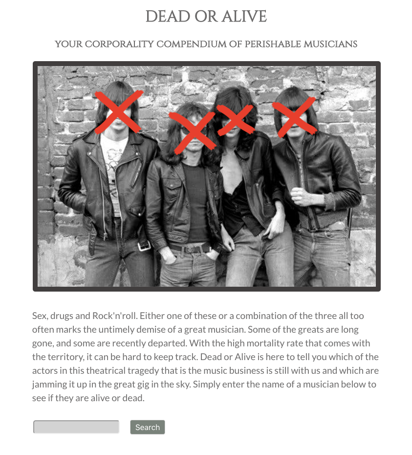
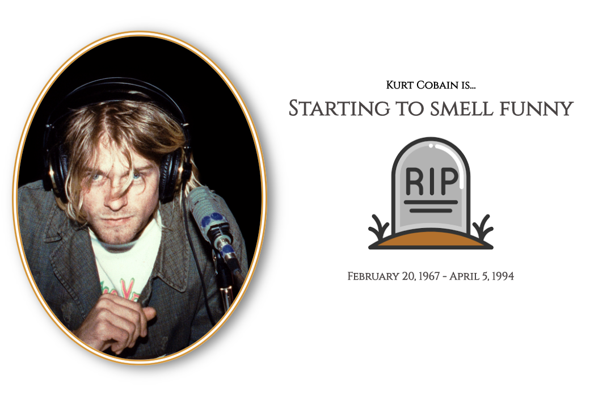
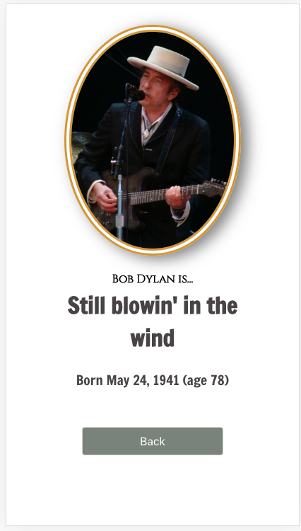
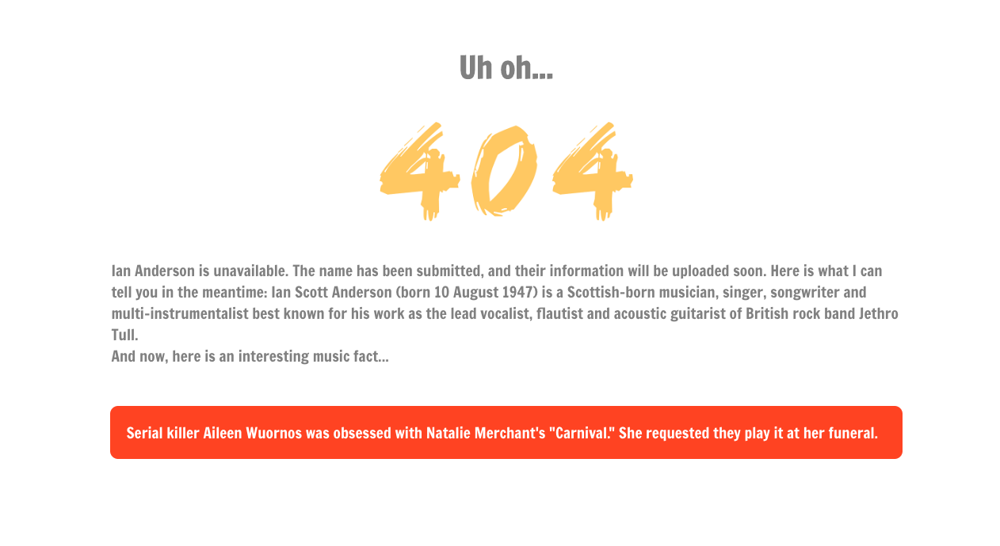

# Dead or Alive
### A Corporality Compendium of Perishable Musicians

## Table of Content
* [General Info](#general-info)
* [Technologies](#technologies)
* [Setup](#setup)
* [Features](#features)
* [Screenshots](#screenshots)

### General Info
With the unforunately high mortality rate in the music industry given the libertine attitude and debauchery that comes with the territory, it can be hard to keep track of which musicians are still here and which are no longer with us. This app is a simple tool that checks entries in a database based on a name query and returns whether a musician is alive or dead.  The database was created with Express and PostgreSQL and can be found at [this repo](https://github.com/BC1985/dead-or-alive-api).

## [Live app](https://dead-or-aliveclient.benjcohen1985.now.sh)

### Technologies
Project is created with:
* React
* CSS3

### Setup
Clone this repo to your desktop and run `npm install` to install all the dependencies. When you're done, type `npm start`.

### Features 
* Enter musician name and see if they are still alive or not still alive (:
* Different UI and descriptions based on mortality status
* Posts to designated endpoint if person not found in main musicians pool
* Displays information from wikipedia API if person not found in db
* Responsive layout

#### Screenshots

